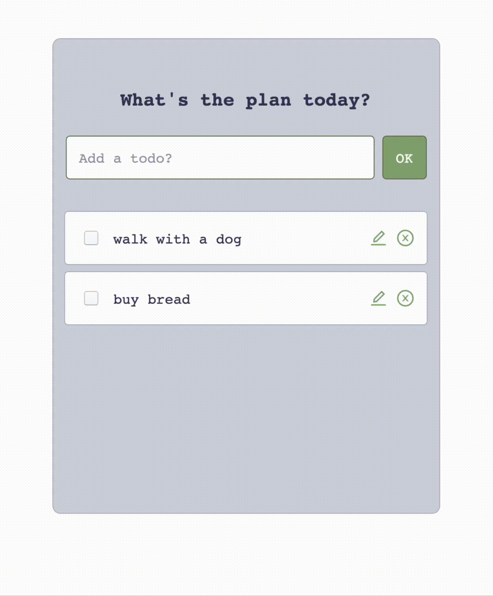
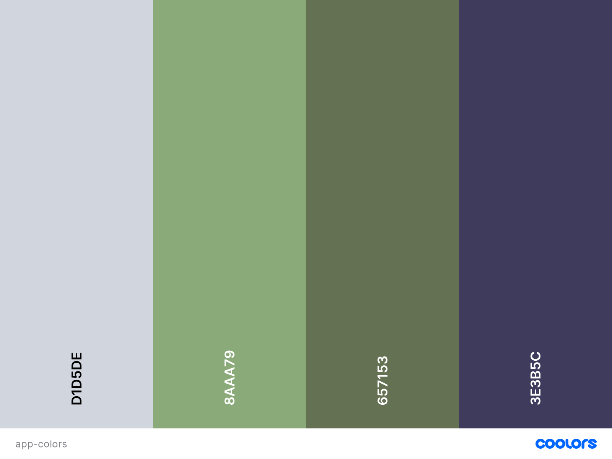
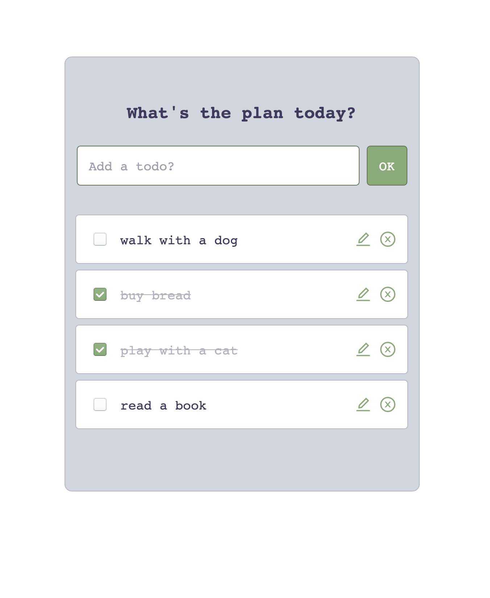

# Todo-List :pencil2:

A simple and minimal React-based to-do list web application

:point_right: [See live demo](https://choosealicense.com/licenses/mit/) :boom:

## About the project

Web App consist of three components Todo, TodoForm and TodoList

As a user, you can:

:white_check_mark: read a list of tasks
:white_check_mark: add a task
:white_check_mark: mark any task as completed
:white_check_mark: delete any task
:white_check_mark: edit any task

## Visuals
For palette I use [coolors.co](https://coolors.co/)

Simple and concise web application design
 

## Features and frameworks:
* React Hook (useState)
* react-icons
* drag and drop (react-beautiful-dnd)
* material-ui

## Contributions
Your contributions are always welcome!

